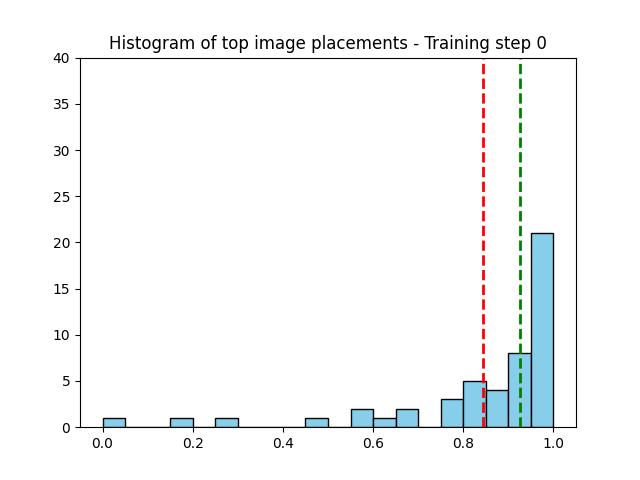
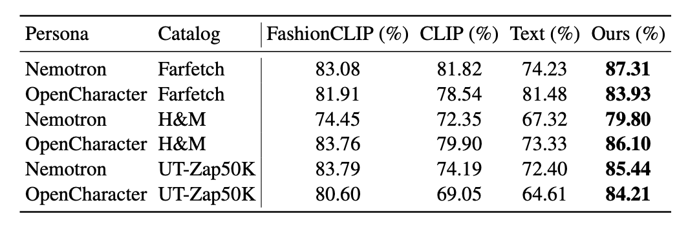
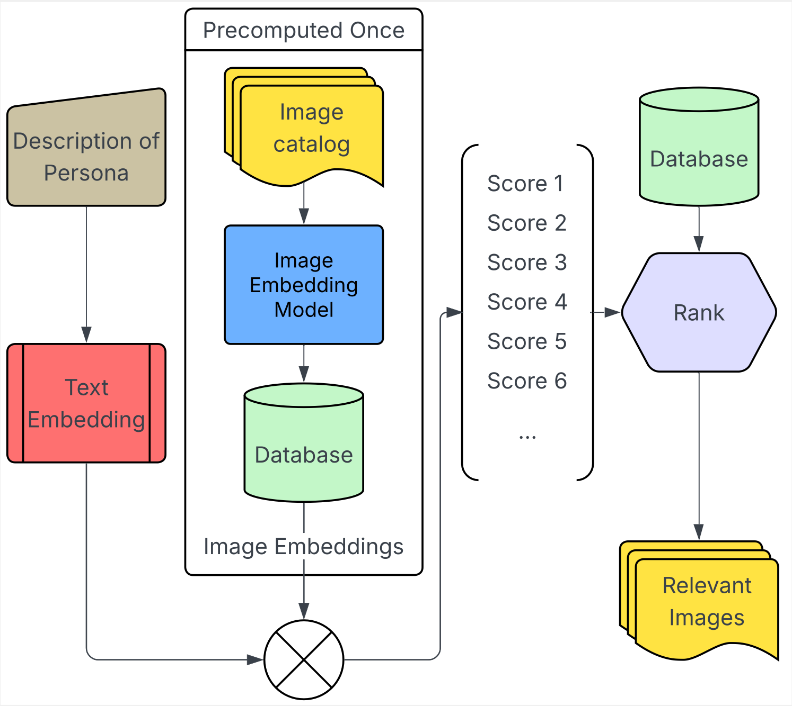
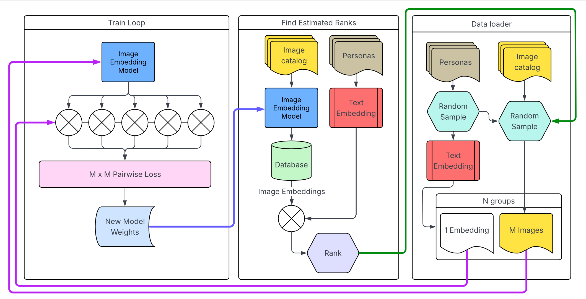

# Preference Aligned Distillation

**Efficient Preference Distillation for Personalized Text–Image Retrieval**

## Overview

**Preference Aligned Distillation (PAD)** is a framework for efficient, personalized text–image retrieval. Traditional embedding-based approaches like CLIP enable large-scale retrieval via vector similarity search but often struggle to capture abstract or persona-driven attributes (e.g., *"a gift for a mother who loves gardening"*).  

PAD distills the nuanced preference rankings from a powerful vision–language model (vLLM) into a scalable embedding-based system, combining the strengths of both approaches:  

- **Nuanced alignment:** Learns from the rich context of vLLMs.  
- **Scalable inference:** Maintains efficiency for large catalog retrieval.  

Experiments show PAD significantly outperforms traditional embedding-based baselines in persona-driven product recommendation tasks.

**Preprint:** [https://arxiv.org/abs/2510.12014](https://arxiv.org/abs/2510.12014)

<p align="center"></p>

---

## Key Features

- Distills preferences from vLLMs into embeddings for efficient retrieval  
- Supports personalized and abstract text–image queries  
- Maintains scalability for large datasets  
- Demonstrated performance improvements on product recommendation tasks  

---

## Performance / Results

<p align="center"></p>

---

## Model Architecture / Scalable Inference

PAD combines the rich preference alignment of vLLMs with the efficiency of embedding-based retrieval.

<p align="center"></p>

---

## Cyclical Training Process

PAD uses cyclical training to distill preference rankings effectively from vLLMs to embeddings. When distilling from the vLLM, it is useful to select a range of different images with some being good match and some being bad matches (random sample leads to mostly bad matches and nothing useful to learn), so at each stage, we sample new data with the present best model for the next training step.


<p align="center"></p>

---

## Installation

```bash
# Clone the repository
git clone https://github.com/ericyh/Preference_Aligned_Distillation.git
cd Preference_Aligned_Distillation

# Install dependencies
pip install -r requirements.txt
```

---

## Citation

If you use this work in your research, please cite:

```bibtex
@misc{he2025embeddingteacherdistillingvllm,
      title={Embedding the Teacher: Distilling vLLM Preferences for Scalable Image Retrieval}, 
      author={Eric He and Akash Gupta and Adian Liusie and Vatsal Raina and Piotr Molenda and Shirom Chabra and Vyas Raina},
      year={2025},
      eprint={2510.12014},
      archivePrefix={arXiv},
      primaryClass={cs.IR},
      url={https://arxiv.org/abs/2510.12014}, 
}
```
